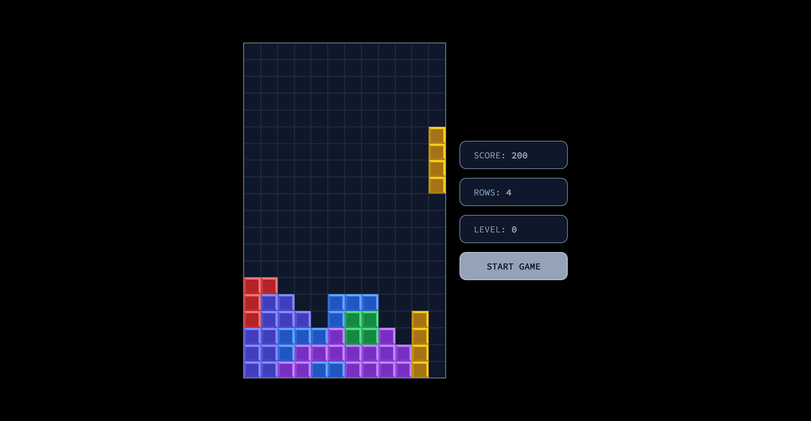

# React Tetris

## Table of contents

- [Overview](#overview)
  - [The challenge](#the-challenge)
  - [Screenshot](#screenshot)
- [My process](#my-process)
  - [Built with](#built-with)
  - [What I learned](#what-i-learned)
  - [Useful resources](#useful-resources)
- [Author](#author)

## Overview

### The challenge

Users should be able to:

- View the optimal layout for the game depending on their device's screen size
- Play Tetris with increasing difficulty as they clear rows
- View accumulated score, rows cleared, and current level
- Start new game and clear previous results

### Screenshot

## My process

### Built with

- [React](https://reactjs.org/) - JS library
- [TypeScript](https://www.typescriptlang.org/) - JS Superset
- [Tailwind CSS](https://tailwindcss.com/) - Styles

### What I learned

I learned a ton about working with multidimensional arrays, building custom hooks, collision detection, and working with custom types

### Useful resources

- [How to Build Tetris in React - GameDev Tutorial (with React Hooks!)](https://youtu.be/ZGOaCxX8HIU) - Tutorial on building Tetris in React

## Author

- Website - [Justin Fowler Art](https://www.justinfowlerart.com)